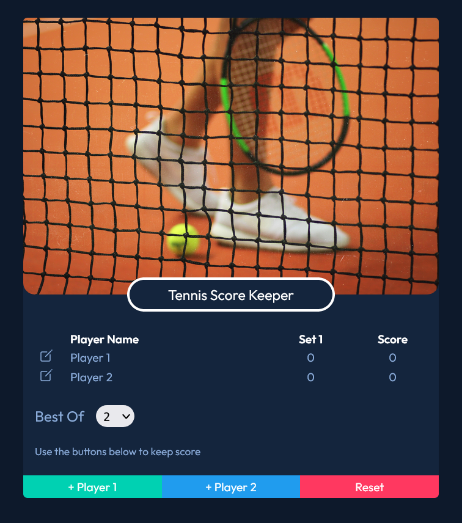

# Tennis Score Keeper v2

This is my improved version of a codealong project from Udemy course "The Web Developer Bootcamp 2022" by Colt Steele, instead of basic counter for score keeping, I made this one with a little bit more complicated logic for keeping tennis score and add my own design instead of using Bulma.

### Links

- Live Site URL: https://djole-zr.github.io/Tennis-Score-Keeper-v2/

### Screenshot

